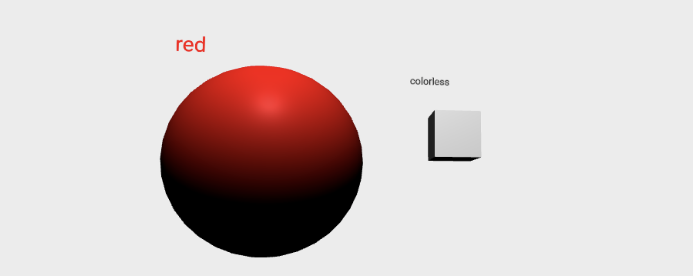

# A-Frame + Typescript

This document will describe how to use the `aframe-typescript-toolkit` to create custom, shareable A-Frame components and systems using Typescript. This repository offers wrapper classes for A-Frame building blocks such as Components and Systems, making it easy to build A-Frame code that looks and feels like idiomatic Typescript code.

Also included is a command line tool which can be invoked to generate easily extendable templates upon which to build your A-Frame components.

---

## Using the command line tool (aka CLI)

You can install the CLI globally, or run it locally from repository source.

Install it globally:

```npm install -g aframe-typescript-toolkit```

Then run it:
```
aframe-typescript-toolkit
```

To run it locally:

1. Install the dependencies:
```npm install```

2. Run the cli:
```npm run cli```

Once invoked, the CLI will ask you what type of A-Frame component template to generate:

```
? What A-Frame Typescript template would you like to start with? (Use arrow keys)
❯ component
  system
```

```
? What A-Frame Typescript template would you like to start with? component
? Project name: awesome-component
```

In the above example, a directory called `awesome-component` will be created containing all the code you need to develop a typescript A-Frame component, including a live development server.

---

## Running a generated template

1. Change directory into the generated component and install the dependencies:

```
cd awesome-component
npm install
```

2. Start the development server:

```
npm run start
```

When the development server starts, your browser will automatically open to port `3000` and you will be able to start using the template component right away.

Click on the video below to see how you can edit the program in Visual Studio Code and watch your changes be dynamically applied without explicitly reloading the browser:

[](https://www.youtube.com/watch?v=bazU6D-LYDI "A-Frame Typescript Toolkit")

---

## Usage (without global installation)
We recommend using the aframe-typescript-toolkit CLI for expediency and ease of use. However, if you'd like to create an `aframe-typescript-toolkit` project from scratch. This section is for you. 
The code discussed below is similar to the one component template generated by the CLI in the previous section. 

An A-Frame typescript component is created in three steps:
1. Setup your project
2. Define and register a component or system class
3. Use your custom component in a local A-Frame project using webpack
4. Export your custom component via GitHub & RawGit to be shared and used in other A-Frame projects

### Project Setup 
We recommend creating a directory with the following structure:
```
new-component
│   README.md
│   package.json    
│   webpack.config.js
│   tsconfig.json
│
└───src
    │   index.html
    │   index.ts
```

We will discuss how to setup your webpack and other configurations below. You can refer to the [example projects](https://github.com/olioapps/aframe-typescript-toolkit/tree/master/examples/position_logger_component) for webpack, node scripts, and tsconfig boilerplate or use a custom setup depending on your needs. 

Install A-Frame Typescript Toolkit into your project

`yarn add aframe-typescript-toolkit`

### Create and register your component (or system) class

#### 1. import `ComponentWrapper` and `EntityBuilder` into `index.ts`

```typescript
import { ComponentWrapper, EntityBuilder } from "aframe-typescript-toolkit"
```
#### 2. Define a schema for your component's data
```typescript
interface NewComponentSchema {
    readonly color: string
}
```
#### 3. Define your component class by extending ComponentWrapper
```typescript
export class NewComponent extends ComponentWrapper<NewComponentSchema> {

    constructor() {
        super("new-component", {
            color: {
                type: "string",
                default: "colorless",
            }, 
        })
    }
    
    init() {
       
    }
}
```

#### 4. Define component behavior
Now you can define the visual aspects or behavior of your component. We'll add an entity on init using `Entity Builder`. 
```typescript
    ...
    init() {
        const entityColor = this.el.getAttribute("color")
        EntityBuilder.create("a-text", {
            id: "color-text",
            value: entityColor || this.data.color,
            color: entityColor || "black",
            position: "-1 1.25 0",
        }).attachTo(this.el)
    }

```

#### 5. Register your component
at the bottom of your `index.ts` file, after defining your component register it so it can be used in your A-Frame scene.
```typescript
new NewComponent().register()
```
### Using your Custom Component Locally

#### 1. Compiling typescript with Webpack
To use your custom component locally, your typescript file must be compiled into javascript. Webpack is a convenient tool to accomplish this. You can configure your 'webpack.config.js` to suit your needs. However, if you're new to webpack or don't require a custom setup, you can copy the [webpack config from one of our examples](https://github.com/olioapps/aframe-typescript-toolkit/blob/master/examples/position_logger_component/webpack.config.js), or use the webpack.config.js generated by the CLI.

See the [webpack](https://webpack.js.org/concepts/) documentation for more details. 

#### 2. Include and Install all dependencies
Like the webpack config, you might find it easier to copy the dependencies from one of our [examples](https://github.com/olioapps/aframe-typescript-toolkit/blob/master/examples/position_logger_component/package.json) into your `package.json` file. 

Then run `npm install` to install all dependencies 

#### 3. Add build scripts
If you have copied the webpack config and dependencies, you can also copy the build scripts from the [example](https://github.com/olioapps/aframe-typescript-toolkit/blob/master/examples/position_logger_component/package.json) into your project's `package.json` file.
```json
    ...
    "scripts": {
        "build": "cross-env NODE_ENV=production webpack --config ./webpack.config.js  --progress --profile --color --display-error-details --display-cached --bail",
    ...
```
#### 4. Make a build
In your command line, run `npm build` to create a production build using webpack. 

You will see `./dist` directory has been created inside of your root directory (or otherwise if you used a custom webpack configuration).

#### 5. Create an index.html A-Frame Scene
In your `index.html` file (in the root directory), include the scripts for A-Frame as well as your custom component (`/index.js`). The way we have configured our example projects creates a copy of index.html into the /dist folder which is ultimately served. So our index.html file points to `/index.js`. Yours might point to `/dist/index.js` depending on your setup. 

In the A-Frame scene, create an entity using your component by including the component's name defined in the constructor. In this example, the component's name is `new-component`. 

```html
<html>
    <head>
        <!-- This is the A-Frame CDN -->
        <script src="https://aframe.io/releases/0.8.0/aframe.min.js"></script>
        
        
        <!-- This is the file you created in the previous step -->
        <script type="text/javascript" src="/index.js"></script>
    </head>
    <body>
        <a-scene embedded antialias="true">
            <a-sphere 
                color="red" 
                position="-1 2 -5"
                new-component 
            >
            </a-sphere>
            <!-- 'new-component' is the name we gave our component in the constructor-->
            <a-box
                position="2 3 -10"
                new-component
            >
            </a-box>
            <a-sky color="#ECECEC"></a-sky>
            <a-light position="0 10 0" color="white" type="point"></a-light>
        </a-scene>
    </body>
</html>
```
#### 6. View your A-Frame Scene

Locally serve your project to see what you've created. If you were following the examples, you can run the command `yarn start` to serve the project to localhost:3000. This server will listen to any changes you make to the /src directory

Alternatively, you can run a command like `python -m SimpleHTTPServer 3000` from your root directory and then visit your web browser at http://localhost:3000/src. Using this method , remember you'll have to rebuild your project using `npm build` to see any changes to `index.ts`.



### Exporting Custom Components
Seeing your component run locally is great. Now it is time to export it so it can be used by others. There are many ways to do this. One free and convenient way is through GitHub and RawGit

#### 1. Publish your project to GitHub 
See [GitHub's docs](https://help.GitHub.com/) if you are not familiar with this process. 

#### 2. Create a CDN for your component class
Expose your `dist/index.js` file to a CDN like https://www.jsdelivr.com/ and it can be used in any A-Frame project like a traditional A-Frame component (or system).

---

## A-Frame Typescript Classes 

Discussed below are the building blocks of the Typescript toolkit for A-Frame. 

### EntityBuilder
Entity builder allows you to create A-Frame entities, set attributes, and attach them to the scene other A-Frame elements. 
```javascript
import { EntityBuilder } from "aframe-typescript-toolkit"

const scene = document.getElementById("scene")

EntityBuilder.create("a-text", {
    id: "hello-text",
    value: "Hello Word!",
    color: "blue",
    position: "-1 2 0",
}).attachTo(scene)
```
See the docs for additional information on [EntityBuilder](dist/docs/classes/_entity_builder_.entitybuilder.html)

### ComponentWrapper
The ComponentWrapper is a base class for creating strongly typed A-Frame components. Component lifecycle methods such as init(), tick(), and others are provided, and can be overridden to suit your component's specific behavior.

See the [example](examples/position_logger_component) as well as the [ComponentWrapper docs](dist/docs/classes/_aframe_wrapper_.componentwrapper.html) for more details. 

### SystemWrapper
The SystemWrapper allows you to create typescript A-Frame systems. Components can subscribe themselves to a system, allowing the system to reference its components.

See the [example](examples/sphere_registry_system) as well as the [SystemWrapper docs](dist/docs/classes/_aframe_wrapper_.systemwrapper.html) for more details. 

---

## Examples 
### [Position Logger](https://GitHub.com/olioapps/aframe-typescript-toolkit/tree/master/examples/position_logger_component)
Position Logger A-Frame Component is a complete example of how to use an A-Frame component using `ComponentWrapper`


### [Sphere Registry System](https://GitHub.com/olioapps/aframe-typescript-toolkit/tree/master/examples/sphere_registry_system)
 Sphere Registry A-Frame System is a complete example of a how to create an A-Frame system using `SystemWrapper`

---

## Contact
We are interested in hearing your questions and feedback.

Email: [vr@olioapps.com](vr@olioapps.com)

---

## Additional Reading 
- [aframe-typescript-toolkit Docs](dist/docs/index.html)
- [A-Frame](https://aframe.io/)
- [Typescript](https://www.typescriptlang.org/docs/home.html)

---

## License
This program is free software and is distributed under an MIT License.
