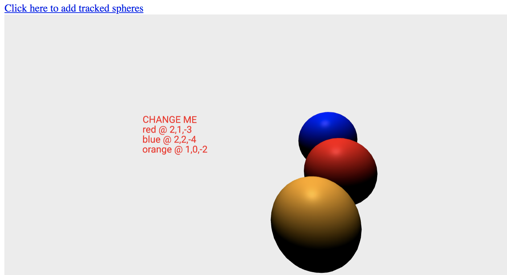

# Custom A-Frame Typescript System

This is a boilerplate A-Frame system created using `aframe-typescript-toolkit`. 

The `sphere-registry` reports the color of an A-Frame entity that has the sphere-registry attached.

## Getting Started 
Run the following commands: 
1. `yarn install` to install the dependencies.
2. `yarn build` to create CDN publishable artifacts in the `dist` folder.
3. `yarn server` will serve the project to http://localhost:3000/ and hot reload on changes made in the `/src` directory

The system (defined in src/index.ts) can be changed in any way to create a custom system. A system provides global scope, services, and management to classes of components. It provides public APIs (methods and properties) for classes of components.

Read the docs for [`aframe-typescript-toolkit`](https://github.com/olioapps/aframe-typescript-toolkit).

Read more about A-Frame systems here: [System](https://aframe.io/docs/0.8.0/core/systems.html)

The scene (defined in src/index.html) is an easy way to see your system in action and test its functionality. 

## Sharing your Custom system
Run `yarn build` to create CDN publishable artifacts in the `dist` folder.

Exposing `dist` via a CDN such as jsdelivr will make it easy for other developers to use your a-frame system.